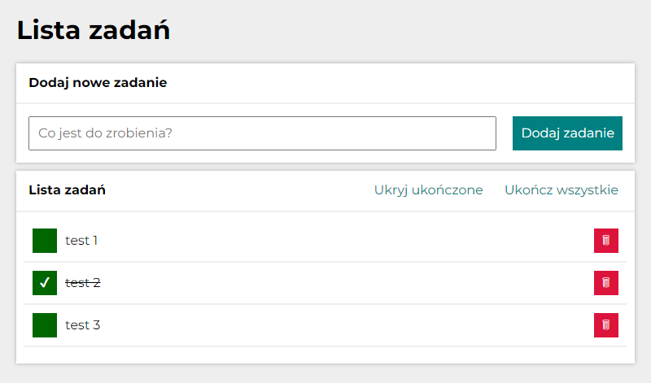

# #03 Tasks list
A simple web app to manage your to-do list.

## 📝 Features
- adding new tasks to the list
- mark tasks as complete or incomplete
- delete tasks from the list
- hide completed tasks

## 🔗 Demo:
https://pevu96.github.io/tasks-list/

## 👨🏻‍💻 Technologies:
- HTML
- CSS
    - Alternative Box Model
    - Normalize.css
- JavaScript
    - ECMAScript 6

## ✍️ Author
This project was created by Patryk Wernerowicz.